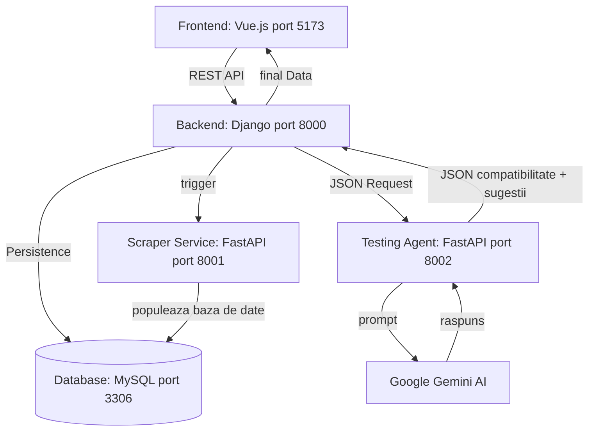
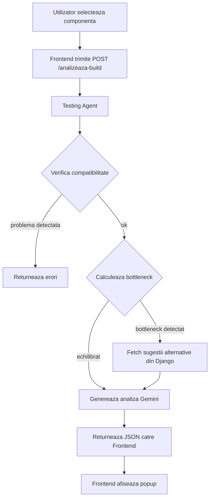
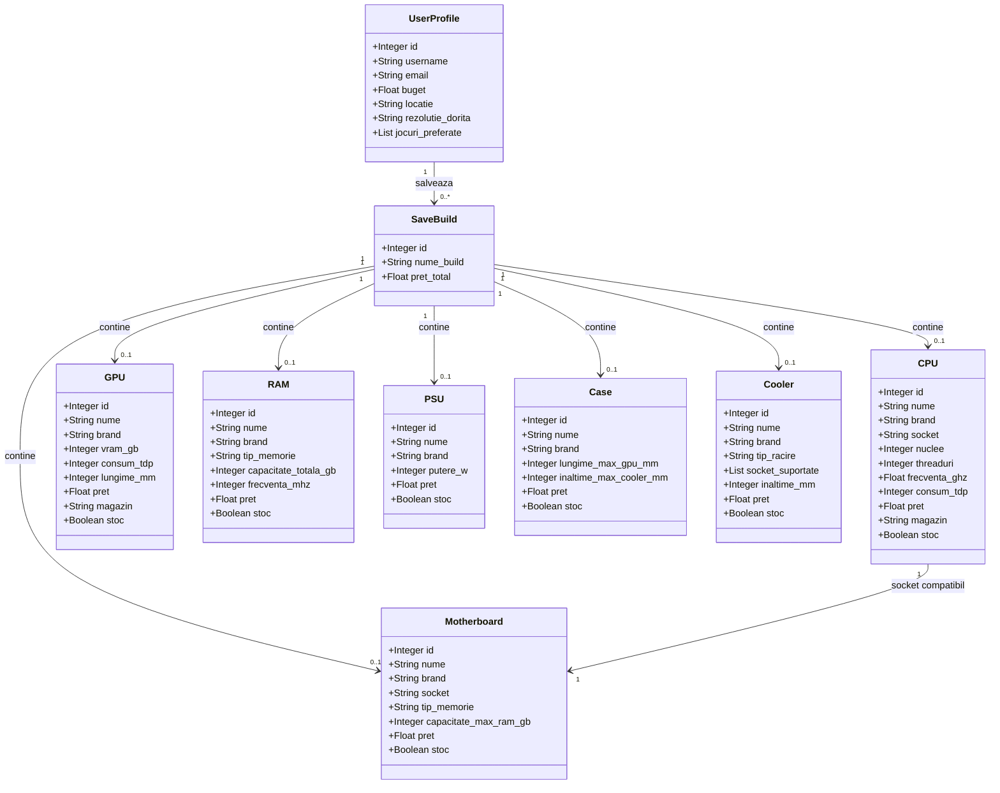

# PC Builder Simulator - Documentatie Completa

Aceasta este o platforma web full-stack avansata care permite utilizatorilor sa isi configureze
un calculator personalizat pe baza unui profil de gaming sau productivitate. Sistemul utilizeaza
web scraping geo-localizat pentru a popula o baza de date cu componente actuale de pe site-urile
mainstream de retail, filtrate dinamic in functie de tara utilizatorului. Inteligenta Artificiala
ghideaza utilizatorul inca de la primul pas, interpreteaza profilul sau si ofera un dashboard tehnic
complet, incluzand indicatori de bottleneck si estimari ale cadrelor pe secunda (FPS) pentru jocurile
preferate, la diferite rezolutii.

---

## Scopul Proiectului

Scopul principal este transformarea preferintelor si bugetului utilizatorului intr-o configuratie PC
optima, justificata tehnic si adaptata geografic, eliminand riscul dezechilibrelor de performanta
(bottleneck) si al achizitiilor incompatibile. Prin cei doi agenti AI specializati, platforma ofera:

- Un "Starter Build" optimizat pe baza bugetului, locatiei si jocurilor preferate.
- Avertizari proactive in timp real despre dezechilibre CPU/GPU detectate.
- Estimari de FPS pentru setari grafice Low, Medium, High si Ultra la 1080p, 1440p si 4K.
- Filtrarea componentelor dupa disponibilitate si pret actualizat in tara utilizatorului.

---

## Arhitectura Sistemului

**Diagrama Arhitecturii**

**Fluxul Testing Agent-ului**

**Diagrama de Clase (Modele de Date)**

Proiectul este impartit in trei componente principale care comunica intre ele:

1. **Backend (Python - Django + Django REST Framework):**
   - Gestioneaza conturile utilizatorilor, logica de business si rutele API REST.
   - Administreaza baza de date relationala MySQL cu componentele indexate pe regiuni.
   - Implementeaza algoritmii matematici pentru calculul bottleneck-ului.
   - Autentificare si autorizare prin JWT (djangorestframework-simplejwt).

2. **Scraper Service (Python - FastAPI):**
   - Contine web scraper-ul geo-localizat (BeautifulSoup/Selenium).
   - Integreaza modelele LLM pentru generarea recomandarilor textuale personalizate.
   - Ruleaza pe un port dedicat, separat de backend.
   - Implementeaza Strategy Pattern pentru scraping diferentiat pe site si tara.

3. **Frontend (Vue 3 + Vite):**
   - Dashboard interactiv de asamblare cu grafice pentru bottleneck.
   - Tabele comparative pentru FPS-uri si flux de onboarding.
   - Comunica cu backend-ul prin REST API.

4. **Baza de Date (MySQL):**
   - Stocare centralizata a componentelor indexate dupa regiune, pret si stoc.
   - Actualizata periodic de scraper-ul asincron.

---

## Instructiuni de Instalare (Setup)

Urmati acesti pasi pentru a configura proiectul pe un calculator nou dupa git clone.

### 1. Cerinte Prealabile

Asigurati-va ca aveti instalate urmatoarele:

- Docker Desktop (pentru baza de date MySQL).
- Python 3.10+.
- Node.js 18+ si npm.
- Git.
- Un API Key Anthropic (pentru agentii AI).

### 2. Clonarea Proiectului

\`\`\`bash
git clone https://github.com/radu433/Pc-Builder-Simulator.git
cd pc-builder
\`\`\`

### 3. Configurarea Bazei de Date (Docker)

\`\`\`bash
docker-compose up -d
\`\`\`

Acest lucru va porni o baza de date MySQL pe portul 3306 cu numele pc_builder_db.

### 4. Configurarea Backend-ului (Django)

\`\`\`bash
cd backend-django
python3 -m venv venv
source venv/bin/activate
pip install -r requirements.txt
\`\`\`

Creati un fisier .env in acest folder dupa modelul .env.example, apoi:

\`\`\`bash
python manage.py migrate
python manage.py createsuperuser
python manage.py runserver
\`\`\`

Backend-ul va rula pe http://localhost:8000.

### 5. Configurarea Scraper Service (FastAPI)

\`\`\`bash
cd scraper-service
python3 -m venv venv
source venv/bin/activate
pip install -r requirements.txt
\`\`\`

Creati un fisier .env cu ANTHROPIC_API_KEY, apoi:

\`\`\`bash
uvicorn main:app --reload --port 8001
\`\`\`

Serviciul va rula pe http://localhost:8001.

### 6. Configurarea Frontend-ului (Vue)

\`\`\`bash
cd frontend-vue
npm install
npm run dev
\`\`\`

Frontend-ul va rula pe http://localhost:5173.

---

## Utilizare Rapida

- Onboarding: Creati un cont si completati chestionarul initial (buget, tara, jocuri preferate, rezolutie tinta).
- Starter Build: Agentul AI va propune automat o configuratie optima justificata tehnic.
- Asamblare Manuala: Modificati componentele din dashboard si urmariti indicatorii de bottleneck in timp real.
- Performance Preview: Vizualizati estimarile de FPS pentru jocurile alese la diferite rezolutii si setari grafice.

---

## Note Tehnice

- Porturi: MySQL (3306), Django (8000), FastAPI Scraper (8001), Vue (5173).
- Design Patterns: Strategy Pattern pentru scraping, Builder Pattern pentru configuratia PC.
- Teste: Acoperire cu pytest pentru formulele de calcul al bottleneck-ului si algoritmii de recomandare.
- Securitate: JWT implementat in layerul Django, comunicare securizata intre servicii prin REST API intern.
